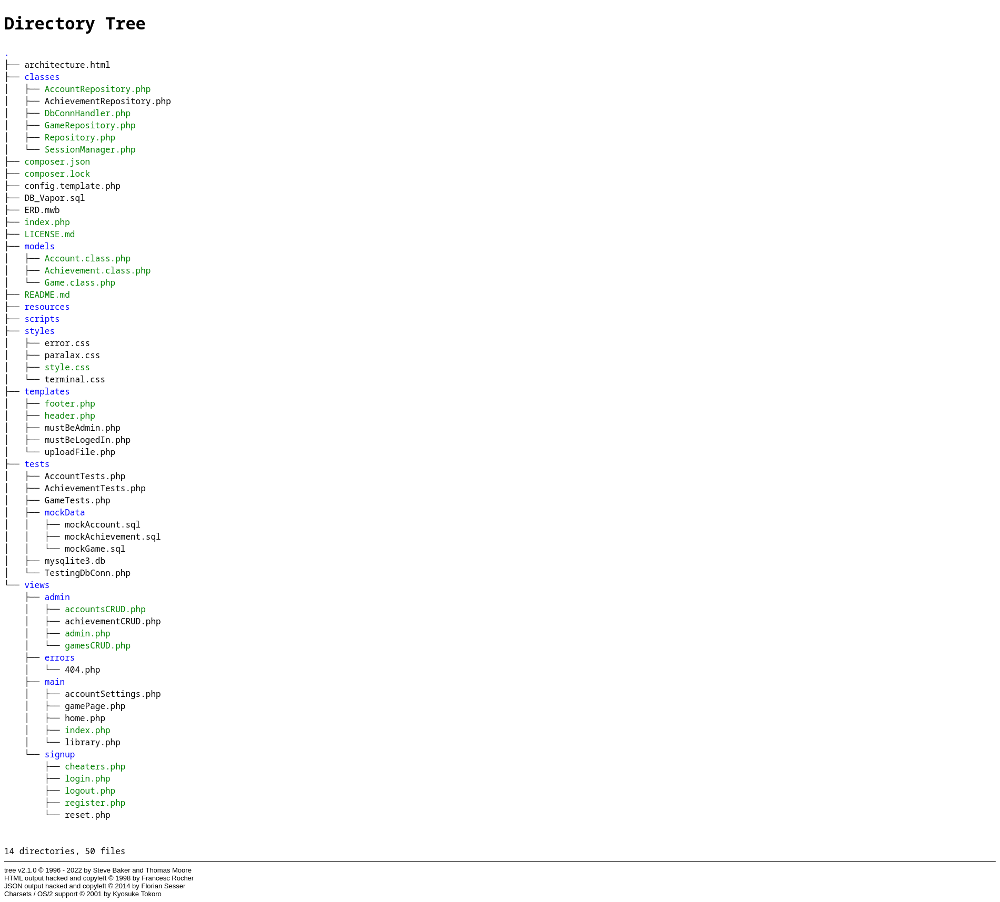

# Vapor
Modul 133 Project
by Robin, Sven and Dimitrios

# Link zum Projekt
https://github.com/dlanaras/vapor

### WICHTIG: Tests können aktuell mit Composer nur manuell ausgeführ werden (also nicht ./vendor/bin/phpunit tests sondern ./tests/GameTests.php)

### HINWEIS: Damit der Import von DB_Vapor.sql funktioniert, muss in phpmyadmin zuerst eine leere DB namens DB_Vapor erstellt werden und dann bei der "Import" Teil davon importiert werden

### BEMERKUNG: Existierende Passwörter innerhalb von DB_Vapor.sql folgen nicht die Kriterien die beim Registrieren gesetzt sind (Also sind sie nicht unbedingt >=8 Zeichen lang und beinhalten nicht unbedingt eine Zahl) 

# Architektur

### classes
Innerhalb vom classes Ordner befinden sich alle Repository-Klassen und eine Datenbankverbindungsklasse.
Die Repository-Klassen machen alle Abfragen an die Datenbank und geben die Resultate weiter.

### models
Innerhalb vom models Ordner befinden sich alle Model-Klassen. Diese dienen
zum Erstellen von Objekten, welche die Daten aus der Datenbank repräsentieren.

### resources
In den resources Ordner befinden sich die verschiedene Bilder, welche für die Darstellung der Website benötigt werden.

### scripts
Dieser ist ein spezieller Ordner, der JS-Scripts beinhaltet. In diesem
Projekt haben wir nur eine Datei namens "terminal.js" und diese hilft
beim Styling der Konsole, die beim gamePage.php angewendet wird.

### styles
Dies ist sehr selbsverständlich, denn hier befinden sich alle CSS-Dateien, die für die Darstellung der Website benötigt werden.

### templates
In diesem Ordner befinden sich PHP Dateien, die mehrmals verwendet werden.

### tests (und mockData)
Dieser Ordner ist ebenfalls selbsverständlich, denn hier befinden sich alle Test-Dateien, die wir für unser Projekt geschrieben haben.
Der mockData Ordner beinhaltet alle mock Daten, die wir für die Tests benötigen.

### views
Da befinden sich die verschiedene Views der Applikation

#### admin
In diesem Ordner befinden sich alle Views, die nur für Admins sichtbar sind.

#### errors
In diesem Ordner befinden sich alle Views, die für Fehlermeldungen verwendet werden.

#### main
In diesem Ordner befinden sich alle Views, die für die Hauptseite verwendet werden.

#### signup
In diesem Ordner befinden sich alle Views, die für die Authentifizierung verwendet werden.

### /
Ausser den obig erwähnten Ordnern befinden sich da noch Konfigurationsdateien, die index.php Datei, die für die Ausführung der Applikation benötigt wird
und noch weitere informative Dokumente (wie zum Beispiel: die Lizenz oder das ERD).